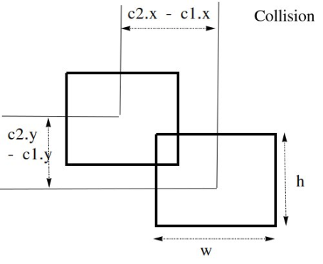

# Space Invaders Game

## Educational game for teaching HTML5 canvas and plain Javascript

### Youtube Tutorial

* [Part One](https://www.youtube.com/watch?v=cQBPIP2LhCM)
* [Part Two](https://www.youtube.com/watch?v=gfBDXWAaxdY)
* [Part Three](https://www.youtube.com/watch?v=f4S6WXpWqfA)

### Work includes:

* HTML5 Canvas
    * draw rectangles
    * draw text
    * animate
    * and more

* Javascript ES6
    * classes, constructors, inheritance, static methods, etc
    * Higher order functions with arrays
    * and more
    
* Uploading to github
    * create remote github repository
    * create local git repository
    * link local repository with remote one
    * commit changes to local and to remote repos.

* Having fun !

#### How to detect collision?
